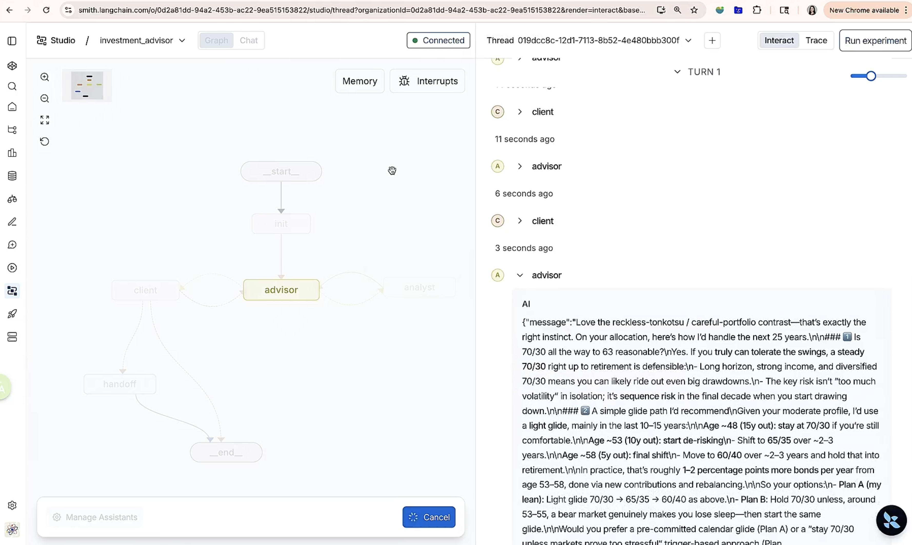

# Multi-Agent Financial Advisor — Design Overview

> **Audience:** Reviewers who want a fast, accurate picture of the architecture, key design decisions, and where the system can grow.

---

## 1. What It Does

An autonomous, multi-agent conversation system that simulates a **financial advisory meeting** end-to-end.  
Given a client profile (risk tolerance, holdings, goals), the system:

1. Opens with a personalised strategy recommendation
2. Answers client questions, triggering live research when needed
3. Detects client satisfaction and closes with a written summary
4. If the turn limit is reached and the client is **still not satisfied**, automatically generates a **human-handoff memo** to transfer to a human agent

The entire flow runs autonomously — the client is simulated by an LLM persona. A human agent is only involved as a fallback when the turn limit is reached and the client remains unsatisfied.

---

## 🎬 System Demo

End-to-end multi-agent financial advisor workflow.

- Advisor proposes a structured allocation  
- Client iteratively challenges and refines the plan  
- Analyst performs on-demand research  
- System detects satisfaction and terminates automatically  

<<<<<<< HEAD
[](assets/demo.mp4)
*▶ Click to watch — 60-second walkthrough*
=======
👉 60-second walkthrough:  
[](https://github.com/user-attachments/assets/75efbbcb-833b-46a7-84b8-98caca51def3)
>>>>>>> 0683ba9dce2e7ddca8084acb12b57be26ee690a5

---

## 2. Graph Flow

```
START
  └─► init
        └─► advisor ──► (needs_research = yes) ─► analyst ─► advisor
                    └─► (needs_research = no)  ─► client
                                                  ├─► satisfied = yes ─► END
                                                  └─► satisfied = no
                                                        ├─► turn limit = yes ─► handoff ─► END
                                                        └─► turn limit = no  ─► advisor
```

Note: after any unsatisfied client turn, control returns to `advisor`. If the client introduces a **new topic** or exposes a new information gap, the advisor can set `needs_research = true` again and re-trigger `analyst`.

| Node | Agent | Responsibility |
|------|-------|----------------|
| `init` | — | Normalize state; coerce `client_profile` dict → Pydantic; parse profile from Studio Chat message |
| `advisor` | `AdvisorAgent` | Strategy-grounded recommendations; decides if research is needed; applies output guardrails |
| `analyst` | `AnalystAgent` | ReAct loop — web search + knowledge base — returns `ResearchReport` |
| `client` | `ClientAgent` | LLM persona speaks as the client; sets `is_satisfied`; applies input guardrails |
| `handoff` | `AdvisorAgent` | Generates a human-agent briefing memo when turn limit is reached and client is still not satisfied |

---

## 3. Shared State (`ConversationState`)

```python
class ConversationState(MessagesState):
    client_profile: ClientProfile       # investor persona (Pydantic)
    turn_count: int                     # incremented by ClientAgent each turn
    is_satisfied: bool                  # exit signal — takes priority over turn limit
    needs_research: bool                # routing signal → analyst node
    latest_research: ResearchReport | None
    research_history: list[str]         # dedup guard — prevents re-researching the same query
    final_summary: str                  # advisor's closing statement
    handoff_summary: str                # human-agent briefing memo
```

**Key decisions:**
- `research_history` prevents the advisor from looping on already-covered topics
- `needs_research` cleanly decouples advisor logic from graph topology
- `init` node handles three profile sources: hardcoded closure → state key (Studio State panel) → first chat message content (Studio Chat tab)

---

## 4. Agent Design

### AdvisorAgent
- Calls `StrategyFactory` on every turn to anchor recommendations to a deterministic baseline — the LLM never hallucinates a portfolio from scratch
- Outputs a structured `AdvisorDecision` (Pydantic) with `needs_research`, `research_query`, `is_done` fields
- Every outgoing message passes through the **advisor output guardrail chain**

### AnalystAgent
- LangGraph `create_react_agent` with two tools: **Tavily web search** + **ChromaDB knowledge base**
- Always instructed to use both tools so answers combine live market data with curated investment principles
- Extracts source citations from tool output for traceability

### ClientAgent
- Strict first-person system prompt prevents the LLM from narrating about the client instead of *being* them
- `additional_notes` in `ClientProfile` are converted into **live behavioral instructions** — personality traits (distracted, anxious, skeptical) are actively exhibited, not just described
- Outputs structured `ClientOutput` with `is_satisfied` flag

---

## 5. Investment Strategy (Strategy Pattern)

| Risk Tolerance | Strategy | Equities | Bonds | Real Estate | Cash |
|----------------|----------|----------|-------|-------------|------|
| Conservative | `ConservativeStrategy` | 25% | 55% | 10% | 10% |
| Moderate | `ModerateStrategy` | 60% | 30% | 7% | 3% |
| Aggressive | `AggressiveStrategy` | 85% | 10% | 5% | 0% |

These allocations are an intentionally simplified, hardcoded baseline used to make the current system easy to understand, review, and test. In a production-grade version, strategy rules should be externalized and made more dynamic based on richer client inputs, constraints, and market context.

Each strategy returns a `StrategyRecommendation` with allocation targets, suggested instruments, rebalancing frequency, and key risks — injected directly into the advisor's system prompt.

---

## 6. Guardrail Pipeline (Chain of Responsibility)

Two separate chains, assembled at runtime:

**Advisor Output chain**

| Order | Guardrail | Action | Behaviour |
|-------|-----------|--------|-----------|
| 1 | `TurnLimitGuardrail` | **Block** | Stops processing if turn count ≥ limit; returns rejection reason |
| 2 | `OffTopicGuardrail` | **Block** | LLM semantic classifier; rejects content with no financial relevance |
| 3 | `PIIScrubbingGuardrail` | **Rewrite** | Redacts SSN, card numbers, account numbers, email addresses |
| 4 | `DisclaimerGuardrail` | **Rewrite** | Appends regulatory disclaimer to every outgoing advisor message |

**Client Input chain**

| Order | Guardrail | Action | Behaviour |
|-------|-----------|--------|-----------|
| 1 | `OffTopicGuardrail` (`soft_mode=True`) | **Annotate** | Off-topic messages are tagged `[OFF-TOPIC]` and passed through; advisor is responsible for redirecting |
| 2 | `PIIScrubbingGuardrail` | **Rewrite** | Same PII redaction as above |

`OffTopicGuardrail` uses an **LLM semantic classifier** (not keywords), so financial metaphors like *"treat it like a recipe"* are never incorrectly flagged.

---

## 7. Design Patterns Index

| Pattern | Location | Purpose |
|---------|----------|---------|
| **Strategy** | `src/strategies/investment_strategy.py` | Swap allocation logic per risk profile without touching agent code |
| **Factory** | `src/agents/factory.py` | Decouple graph construction from agent implementation |
| **Chain of Responsibility** | `src/guardrails/validators.py` | Composable, independently testable guardrail pipeline |
| **Repository** | `src/tools/knowledge_store.py` | Encapsulate ChromaDB — lazy init, dedup, ranked retrieval |
| **ReAct** | `src/agents/analyst_agent.py` | Reason + Act loop for grounded, multi-tool research |
| **Structured Output** | `AdvisorDecision`, `ClientOutput` | Type-safe LLM responses via Pydantic — no string parsing |

---

## 8. LangGraph Studio Integration

`src/orchestration/studio_entry.py` exposes a `graph` variable with no constructor arguments.  
The `init` node handles profile injection from **three sources** in priority order:

1. Hardcoded closure (`build_graph(profile)`) — for `main.py` / programmatic use
2. State key (`client_profile: {...}`) — Studio **State** input panel
3. First chat message content — Studio **Chat** tab (JSON pasted by user)

For source 3, the parser handles Studio's multipart message format where `content` is a list of `{'type': 'text', 'text': '...'}` blocks rather than a plain string.

---

## 9. Test Coverage

| File | What's tested |
|------|---------------|
| `tests/test_agents.py` | ClientAgent, AdvisorAgent, AnalystAgent — message output, satisfaction flag, research routing, final summary |
| `tests/test_guardrails.py` | Each guardrail in isolation; soft vs. hard off-topic mode; PII patterns; disclaimer injection |
| `tests/test_graph.py` | Graph routing logic — `route_after_advisor`, `route_after_client`, turn-limit handoff |
| `tests/test_tools.py` | KnowledgeRepository query; web search tool |

**Zero real API calls** — all LLMs and external services are mocked via `unittest.mock.patch`.

---

## 10. Future Improvements

| Priority | Area | Idea |
|----------|------|------|
| 🔴 High | **Human-in-the-loop** | Replace `ClientAgent` with a real UI interrupt so an actual client can participate |
| 🔴 High | **Memory / persistence** | Add a LangGraph `Checkpointer` (e.g. `SqliteSaver`) so conversations survive server restarts and support multi-session continuity |
| 🟡 Medium | **Dynamic strategy** | Externalize strategy rules to a config file or database and support blended, client-specific allocations |
| 🟡 Medium | **User feedback loop** | Collect `thumbs up/down`, free-text feedback, and outcome labels in the UI, then turn them into an evaluation dataset to continuously improve prompts, routing decisions, research triggering, and response quality |
| 🟡 Medium | **Richer client profiles** | Add tax bracket, liquidity needs, ESG preferences, life-event triggers (e.g. upcoming retirement) |
| 🟡 Medium | **Analyst tool expansion** | Add SEC filing search, earnings transcript retrieval, portfolio stress-test calculator |
| 🟡 Medium | **Guardrail observability** | Emit guardrail events to LangSmith as structured metadata for compliance auditing |
| 🟢 Low | **Multi-client sessions** | Thread-safe graph instances per client; parallel conversation support |
| 🟢 Low | **Evaluation harness** | Automated LLM-as-judge scoring for recommendation quality, persona fidelity, and guardrail accuracy |
| 🟢 Low | **Streaming output** | Surface advisor tokens progressively via SSE for a real-time chat UX |
